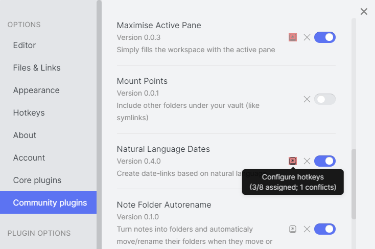

## Hotkey Helper: Easier Hotkey Management for Obsidian

This plugin makes it easier to manage plugins' hotkeys in [Obsidian.md](https://obsidian.md), by displaying a "hotkey" icon next to each plugin in the settings that has configurable commands.  Clicking the icon immediately takes you to the Hotkeys tab, filtered to display just that plugin's commands and hotkey assignments.

Better still: hovering over the icon shows you how many commands the plugin has, how many of those commands have hotkeys assigned, and how many of those assignments conflict with other hotkey assignments.  The icon is also highlighted with the theme's error background color if there are any conflicts.

The icons automatically come and go or change color as you enable or disable plugins, so you can immediately find out where a conflict is taking place, and also so reviewing or setting up a new plugin's hotkeys is quick and easy.

### Installation

To install the plugin, search for "hotkey helper" in Obsidian's Community Plugins interface.  Or, if it's not there yet, just visit the [Github releases page](https://github.com/pjeby/hotkey-helper/releases), download the plugin .zip from the latest release, and unzip it in your vault's `.obsidian/plugins/` directory.

Either way, you can then enable it from the Obsidian "Community Plugins" tab for that vault.

If you encounter any problems with the plugin, please file bug reports to this repository rather than using the Obsidian forums: I don't check the forums every day (or even every week!) but I do receive email notices from Github and will get back to you much faster than I will see forum comments.

### Known Issues/Current Limitations

* The icons are currently only shown on the Community Plugins tab, not the Core Plugins tab.  (But conflicts between core and community plugins will still be shown on the Community plugins tab.)

